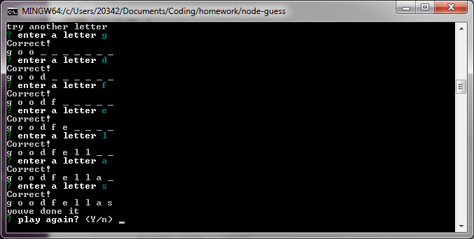

# node-guess

## CLI Word Guessing game

## Instructions

- clone the repo
- enter `npm i` to install the requires packages (in same directory as the application)
- type `node ./assets/index.js` to start the application
- try to guess the name of the movie. you have 5 attempts.

## code overview

the game is setup with the use of constructors. `Letter.js` takes in a letter of the word and returns an `_` or the letter value if it is guessed correctly. `Word.js` takes in the chosen word as a parameter and evaluates the user guess. it displays the word using a `this.displayWord()` as blanks to begin with, and as letters are guessed correctly the `_` is replaced with the correct letter. if the game ends, either by winning or losing, the game is reset and a new Word is contructed.
Inquirer is used to get the user input from the command line as guesses.
Recursion is used within the `getUserPrompt` function to create the game loop, where the user will continue to guess until they win or lose. at that point the user is prompted to play again. if they choose to play again, it triggers the `replay` function, which resets the game variables and calls a new game. if they choose not to play again, the application exits.

- todo items:
- [ ] validate input as letters
- [ ] validate if user has already guessed a letter
- [ ] display incorrectly guessed letters

## Built With:

### Languages

JavaScript, Node.js

### Packages/APIs

- [inquirer](https://www.npmjs.com/package/inquirer) - A collection of common interactive command line user interfaces.

## Authors

- **Gerritt Black** - _Backend/Scripting_ - [gmocore](https://github.com/gmocore)

# screenshots

### start game 

### make a guess

### correct guess

### incorrect guess

### correct word

### incorrect word

